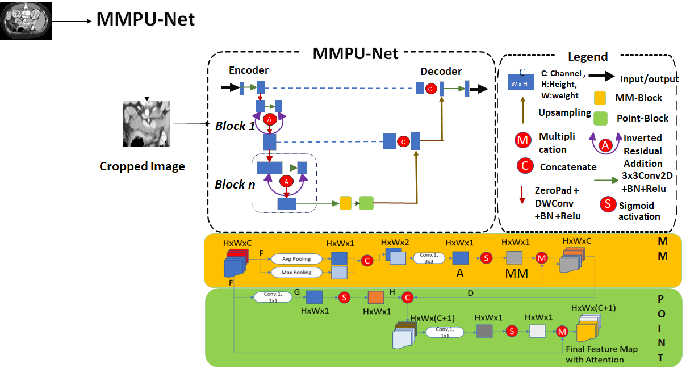

# MMPU-Net: A Parameter-Efficient Network for Fine-Stage Pancreas and Tumor Segmentation on CT Scans

This repository provides the implementation of **MMPU-Net**, a parameter-efficient neural network designed for the **fine segmentation stage** of pancreas and pancreas-tumor segmentation on CT scans.

In this approach, the CT scan images first undergo a **coarse segmentation** step to localize the pancreas. The region of interest (ROI) is then automatically determined using a coarse segmentation model. Although MMPU-Net can also be used for this step, users are free to utilize any other model to perform coarse ROI extraction.

Once the ROI is identified, **fine segmentation** is carried out using MMPU-Net, which is specifically optimized for high-resolution and focused segmentation of the pancreas and tumor region.

We highly recommend referring to the accompanying paper for detailed explanations of the methodology and design rationale.

## Environment Setup

After completing the pre-processing steps, we recommend using **Anaconda** to create the environment and run MMPU-Net.

